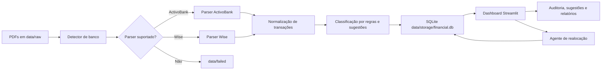
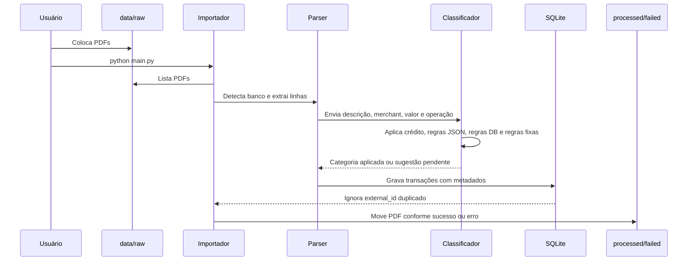
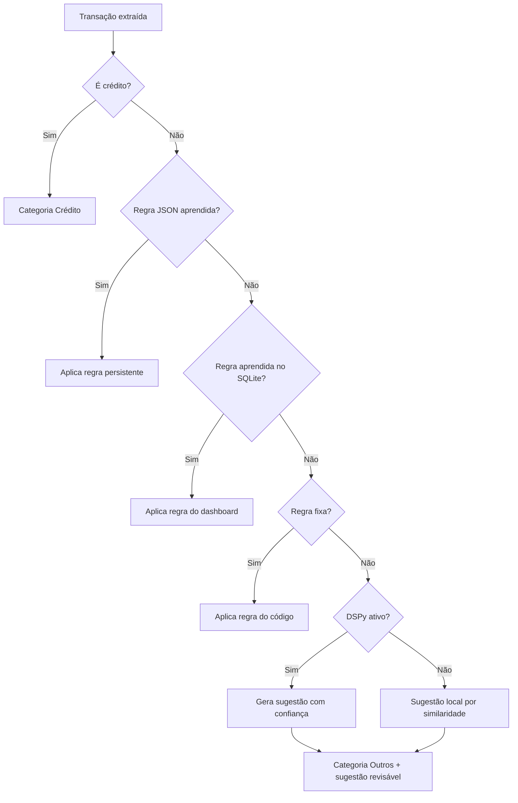
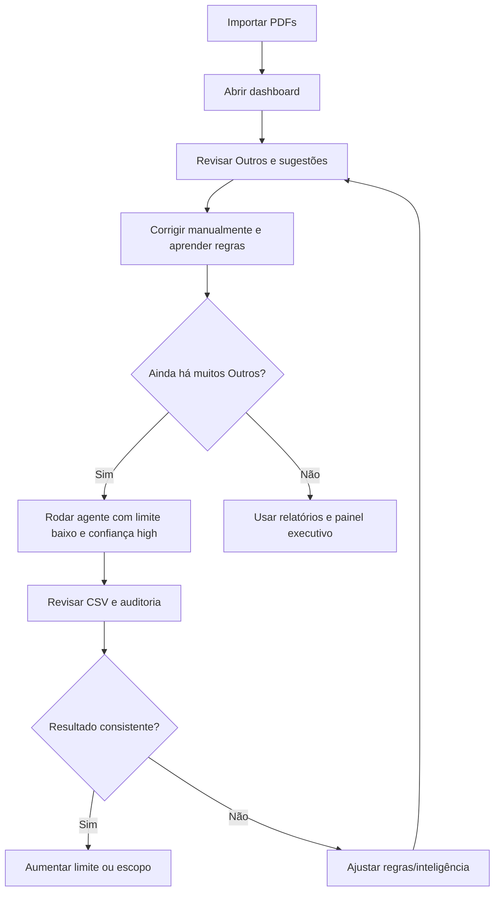

# Financial Parser — Multi-Bank

Projeto Python para importar extratos bancários em PDF, categorizar transações, preservar regras aprendidas e analisar os dados no dashboard Streamlit.

## Ideia principal

O sistema usa uma única pasta de entrada:

```text
data/raw/
```

Você coloca ali qualquer PDF suportado:

- ActivoBank
- Wise
- futuros bancos

O sistema detecta automaticamente o formato do ficheiro, escolhe o parser correto e grava as transações no SQLite com os metadados do banco.

## Visão visual do projeto



O projeto foi desenhado como um pipeline de importação assistido por auditoria.
O importador faz o trabalho repetitivo e determinístico; o dashboard mostra o
resultado, permite correções e aprende regras; os agentes entram apenas onde
existe ambiguidade ou necessidade de revisão.

## Estrutura principal

```text
app/
  categorization/   Regras fixas, regras aprendidas, DSPy e sugestões locais
  dashboard/        Dashboard Streamlit
  database/         SQLite e persistência
  parsers/          Parsers, detector e registry de bancos
  services/         Orquestração da importação

data/
  raw/              Coloque aqui todos os PDFs, sem separar por banco
  processed/        PDFs importados com sucesso
  failed/           PDFs com erro ou formato não reconhecido
  rules/            merchant_rules.json: inteligência aprendida fora do SQLite
  storage/          financial.db
```

## Apps e responsabilidades

O projeto tem mais de uma "app" porque cada uma resolve uma parte diferente do
processo de importação:

- `main.py` / `make import`: app de importação em lote. Lê todos os PDFs em
  `data/raw`, detecta o banco, extrai as transações, evita duplicidades e move
  o PDF para `data/processed` ou `data/failed`.
- `app/dashboard/streamlit_app.py`: app visual. Mostra KPIs, filtros,
  auditoria, sugestões, categorias, relatórios, dados brutos e lançamentos
  manuais.
- `scripts/run_dspy_reallocation_agent.py`: app de agente em terminal. Revisa
  categorias já importadas e pode realocar transações com controle de limite,
  escopo e confiança mínima.
- `Makefile`: atalhos operacionais. Evita decorar comandos longos para importar,
  testar, abrir dashboard ou rodar agente com Ollama.

Essa separação ajuda porque a importação continua simples e reproduzível,
enquanto decisões subjetivas de categoria ficam visíveis no dashboard ou em logs
de agente.

## Bancos suportados

- ActivoBank
- Wise

## Como importar

1. Coloque os PDFs em:

```text
data/raw/
```

2. Execute:

```powershell
python main.py
```

O terminal mostrará algo como:

```text
Processando: statement_20057589_EUR_2026.pdf
Tipo detectado automaticamente: Wise
123 transações importadas
0 transações ignoradas por duplicidade
Movido para processed: statement_20057589_EUR_2026.pdf
```

### Fluxo visual da importação



Durante a importação, cada linha recebe metadados úteis para auditoria:

- `bank`: banco detectado;
- `parse_method` e `parse_status`: origem e qualidade da extração;
- `category` e `category_method`: categoria aplicada e método usado;
- `suggested_category`, `suggestion_confidence`, `suggestion_reason` e
  `suggestion_method`: sugestão revisável quando a categoria não é óbvia.

### Duplicidade entre extratos parciais e finais

A importação evita duplicar transações já gravadas. Quando o banco fornece um
ID da transação, esse ID é usado. Quando o extrato não traz ID próprio, o sistema
gera uma assinatura estável com banco, datas, operação, valor, saldo, merchant e
descrição. Assim, se você importar um extrato no meio do mês e depois outro no
fim do mês contendo as mesmas linhas, as transações antigas são ignoradas e só
as novas entram.

## Como a classificação funciona



A categoria aplicada automaticamente só muda quando existe uma regra
determinística ou uma execução explícita do agente de realocação. Sugestões de
DSPy, Ollama no dashboard/agente ou similaridade local ficam separadas da
categoria real até serem confirmadas ou aplicadas pelo agente com as travas
configuradas.

## Como a abordagem busca precisão

A precisão vem da combinação de camadas, não de uma única resposta de modelo:

- detecção de banco antes do parser, evitando aplicar um layout errado ao PDF;
- normalização de datas, valores, merchant, débito, crédito e saldo;
- chave estável de duplicidade para impedir reimportações repetidas;
- prioridade para regras determinísticas antes de qualquer LLM;
- regras aprendidas persistidas em `data/rules/merchant_rules.json` e no SQLite;
- DSPy/Ollama usados como sugestão ou auditoria, com `confidence` e motivo;
- pesquisa web opcional apenas como contexto, nunca como verdade absoluta;
- dashboard com revisão humana, aplicação em similares e aprendizado de regras;
- logs CSV do agente em `data/logs/` para rastrear cada decisão.

Na prática, o sistema é conservador: quando não há evidência suficiente, mantém
`Outros` ou grava uma sugestão para revisão. Isso reduz alterações automáticas
erradas e torna a evolução das regras auditável.

## Tempo médio de resposta esperado

Os tempos variam conforme tamanho do PDF, quantidade de transações, máquina,
modelo local e latência de API. Como referência operacional:

| Operação | Tempo esperado |
| --- | --- |
| Importação determinística sem LLM | segundos por PDF comum |
| PDF grande com muitas páginas | dezenas de segundos |
| Sugestão local por similaridade | praticamente imediata por transação |
| DSPy com API externa | normalmente alguns segundos por transação analisada |
| Ollama local | alguns segundos por transação, dependendo do modelo e hardware |
| Pesquisa web externa | adiciona latência de rede e do provedor |
| Agente com `AGENT_LIMIT=20` | de alguns minutos a mais, conforme modelo/contexto |

Para uso diário, o fluxo recomendado é importar primeiro de forma determinística
e depois rodar auditoria/agente apenas nas transações `Outros` ou pendentes.

## Como abrir o dashboard

```powershell
$env:PYTHONPATH="."
python -m streamlit run app/dashboard/streamlit_app.py
```

Ou:

```powershell
.\run_dashboard.ps1
```

## Como adicionar outro banco

1. Crie um arquivo novo em `app/parsers/`, por exemplo:

```text
app/parsers/revolut.py
```

2. Implemente uma classe que herda de `BankStatementParser`.

3. Adicione essa classe em:

```text
app/parsers/registry.py
```

Exemplo:

```python
from app.parsers.revolut import RevolutParser

PARSERS = [
    ActivoBankParser(),
    WiseParser(),
    RevolutParser(),
]
```

4. O parser novo deve devolver transações no mesmo formato padrão usado pelos parsers existentes.

## Inteligência preservada

Foram preservados:

- `data/storage/financial.db`
- `data/rules/merchant_rules.json`
- regras de categorização
- sugestões locais e DSPy

## DSPy

A sugestão com DSPy é opcional. Para ativar:

```powershell
$env:ENABLE_DSPY_CATEGORY="1"
$env:OPENAI_API_KEY="sua_chave"
```

Sem DSPy, o sistema continua funcionando com regras fixas, regras aprendidas e sugestão local.

Também é possível usar DSPy como autoauditoria das categorias determinísticas.
Nesse modo, a categoria original não é alterada automaticamente; quando o DSPy
discorda, ele grava `suggested_category`, `suggestion_confidence`,
`suggestion_reason` e a transação aparece na auditoria para confirmação manual.

```powershell
$env:ENABLE_DSPY_AUDIT="1"
```

### Agentes de classificação criados

O projeto usa agentes/funções de decisão com responsabilidades diferentes:

| Agente | Onde atua | O que faz | Altera categoria automaticamente? |
| --- | --- | --- | --- |
| Classificador determinístico | Importação | Aplica crédito, regras JSON, regras DB e regras fixas | Sim, quando há regra |
| Sugeridor local | Importação e dashboard | Compara texto com regras e categorias conhecidas por similaridade | Não |
| Agente DSPy de sugestão | Importação/dashboard, se ativado | Sugere categoria para transações sem regra | Não |
| Agente DSPy de auditoria | Importação/dashboard, se ativado | Revisa categorias determinísticas e grava sugestão se discordar | Não |
| Agente Ollama | Dashboard/terminal, se ativado | Usa modelo local para sugerir ou auditar categorias | Depende do fluxo |
| Agente de realocação | Dashboard/terminal | Aplica sugestões acima da confiança mínima e registra log | Sim, com confirmação/travas |

O agente de realocação é o mais sensível porque escreve de volta no SQLite. Por
isso ele tem limite de linhas, escopo, confiança mínima, confirmação no
dashboard, opção separada para criar categorias e opção separada para aprender
regras.

## Pesquisa web opcional

Para melhorar a classificação de empresas/merchants pouco claros, o DSPy pode
receber pequenos trechos de pesquisa na internet. A pesquisa é opcional,
usa cache local em `data/cache/merchant_research.json` e só roda quando ativada.

Provedores suportados:

- Tavily: `WEB_SEARCH_PROVIDER=tavily` e `TAVILY_API_KEY`
- SerpAPI: `WEB_SEARCH_PROVIDER=serpapi` e `SERPAPI_API_KEY`
- Brave Search: `WEB_SEARCH_PROVIDER=brave` e `BRAVE_SEARCH_API_KEY`
- Ollama local: `WEB_SEARCH_PROVIDER=ollama` e `OLLAMA_RESEARCH_MODEL`

Exemplo:

```powershell
$env:ENABLE_DSPY_CATEGORY="1"
$env:ENABLE_DSPY_AUDIT="1"
$env:ENABLE_WEB_RESEARCH="1"
$env:WEB_SEARCH_PROVIDER="tavily"
$env:TAVILY_API_KEY="sua_chave"
$env:OPENAI_API_KEY="sua_chave_openai"
```

Com pesquisa web ativada, sugestões vindas desse contexto aparecem como
`dspy_web_category` ou `dspy_web_audit`.

### Contexto local com Ollama

Também é possível substituir a pesquisa externa por um modelo local via Ollama:

```powershell
ollama pull qwen2.5:14b

$env:ENABLE_WEB_RESEARCH="1"
$env:WEB_SEARCH_PROVIDER="ollama"
$env:OLLAMA_RESEARCH_MODEL="qwen2.5:14b"
```

Esse modo não pesquisa a internet em tempo real. Ele usa o conhecimento local do
modelo para inferir a atividade provável do comerciante a partir do merchant e
da descrição da transação. O resultado continua sendo usado apenas como contexto
para a decisão de categorização.

Com Makefile:

```powershell
make dashboard-ollama
```

Esse alvo ativa:

```powershell
$env:ENABLE_OLLAMA_CATEGORY="1"
$env:ENABLE_WEB_RESEARCH="1"
$env:WEB_SEARCH_PROVIDER="ollama"
$env:OLLAMA_RESEARCH_MODEL="qwen2.5:14b"
```

Nesse modo, o Ollama faz tanto o contexto inteligente quanto a decisão de
categoria. Não é necessário configurar `OPENAI_API_KEY`.

## Agente de realocação automática

Na aba **Auditoria** existe a opção **Agente DSPy de realocação automática**.
Ela analisa transações já importadas e pode alterar de fato a coluna `category`
no SQLite quando a sugestão do DSPy passa pela confiança mínima escolhida.

O agente tem travas operacionais:

- limite máximo de transações por execução;
- confiança mínima (`high`, `medium` ou `low`);
- escopo entre todas as categorias de débito ou apenas `Outros`;
- confirmação explícita antes de alterar o banco;
- opção separada para criar categorias novas sugeridas;
- opção separada para aprender regras a partir das realocações.

As linhas alteradas ficam com `category_method = dspy_agent_reallocation` e
continuam visíveis na auditoria para revisão posterior.

Também é possível executar pelo terminal, na mesma sessão em que as chaves de
API foram configuradas:

```powershell
python scripts/run_dspy_reallocation_agent.py --limit 20 --confidence high --scope outros
```

Para permitir todas as categorias de débito:

```powershell
python scripts/run_dspy_reallocation_agent.py --limit 50 --confidence high --scope all
```

### Refatorar categorias com pesquisa inteligente local

Fluxo recomendado para melhorar a classificação usando Ollama como contexto
inteligente:

1. Instale e baixe o modelo:

```powershell
ollama pull qwen2.5:14b
```

2. Execute primeiro de forma conservadora, apenas em `Outros`:

```powershell
make agent-ollama-outros
```

Esse comando ativa automaticamente:

```powershell
$env:ENABLE_OLLAMA_CATEGORY="1"
$env:ENABLE_WEB_RESEARCH="1"
$env:WEB_SEARCH_PROVIDER="ollama"
$env:OLLAMA_RESEARCH_MODEL="qwen2.5:14b"
```

Esse comando usa por padrão:

- `AGENT_LIMIT=20`
- `AGENT_CONFIDENCE=high`

3. Revise o resultado no dashboard. As transações alteradas ficam com:

```text
category_method = dspy_agent_reallocation
```

Cada execução mostra um resumo na tela e salva um CSV em:

```text
data/logs/
```

Ao executar pela aba **Auditoria**, a tela mostra a evolução em tempo real:

- barra com quantidade analisada e porcentagem;
- merchant/transação atual;
- status da decisão (`sugerida`, `realocada`, `mantida`, `ignorada`, etc.);
- últimas decisões recebidas do modelo em uma tabela parcial;
- tabela final com todos os detalhes e botão para baixar o CSV.

Ao executar pelo terminal com `make agent-ollama-outros`,
`make agent-ollama-all` ou `python scripts/run_dspy_reallocation_agent.py`, o
processo também imprime uma linha por transação analisada com progresso,
merchant, decisão, categoria atual, categoria sugerida, confiança e método.

O CSV registra, por transação analisada:

- status (`realocada`, `mantida`, `ignorada`, `baixa_confianca`, etc.);
- categoria atual;
- categoria sugerida;
- confiança;
- método usado (`ollama_category`, `ollama_web_audit`, `dspy_web_audit`, etc.);
- motivo retornado pelo modelo.

4. Se os resultados estiverem bons, aumente o limite:

```powershell
make agent-ollama-outros AGENT_LIMIT=100
```

5. Para permitir que o agente revise todas as categorias de débito:

```powershell
make agent-ollama-all AGENT_LIMIT=50 AGENT_CONFIDENCE=high
```

O agente altera a coluna `category` no SQLite. Por isso, use `confidence=high`
nas primeiras execuções e revise as realocações no dashboard antes de ampliar o
escopo.

### Lições aprendidas para a inteligência

O arquivo abaixo guarda conhecimento reutilizável para orientar o agente:

```text
data/rules/category_intelligence.json
```

Ele contém:

- princípios de decisão;
- guia por categoria;
- exemplos `merchant => categoria`;
- possíveis subcategorias.

O agente Ollama consome esse arquivo em cada análise. Quando perceber um padrão,
adicione exemplos em `merchant_examples` ou notas em `category_guidance`. Isso
ajuda o modelo a entender que empresas parecidas devem ser absorvidas pela mesma
categoria ou sugerir subcategorias de forma consistente.

## Modos de dashboard

O Streamlit tem um seletor lateral **Modo de visualização**:

- **Painel executivo**: visão mais próxima de Power BI, com filtros globais,
  KPIs, gráficos compactos, rankings e tabela detalhada.
- **Dashboard atual**: mantém as abas originais com auditoria, sugestões,
  edição de categorias, relatórios e dados brutos.

O painel executivo usa os mesmos dados e regras do projeto; ele é apenas uma
experiência visual/analítica alternativa dentro do mesmo app.

## Lançamentos manuais

O dashboard permite lançar despesas ou créditos manualmente:

- No **Painel executivo**, abra **Novo lançamento manual**.
- No **Dashboard atual**, use a aba **Lançamentos**.

Esses registros entram no SQLite como transações normais, com `bank = Manual`,
`parse_method = manual_entry` e `category_method = manual_entry`, e passam a
aparecer nos filtros, gráficos, balancete e relatórios.

## Testes e verificações para ver o agente atuando

### Testes automatizados do projeto

```powershell
make test
```

ou:

```powershell
python -m unittest discover -s tests
```

Esses testes validam utilitários de normalização e detecção dos parsers
registrados.

### Ver importação determinística

1. Coloque um PDF suportado em `data/raw`.
2. Execute:

```powershell
python main.py
```

3. Confira no terminal:

- banco detectado automaticamente;
- transações importadas;
- duplicidades ignoradas;
- transações em `Outros`;
- sugestões geradas.

### Ver sugestões no dashboard

1. Abra o dashboard:

```powershell
.\run_dashboard.ps1
```

2. Acesse **Dashboard atual**.
3. Abra as abas **Auditoria** e **Sugestões**.
4. Filtre por `category = Outros`, `suggested_category` preenchida ou
   `category_method = dspy_agent_reallocation`.

### Rodar agente local com Ollama em modo conservador

```powershell
ollama pull qwen2.5:14b
make agent-ollama-outros AGENT_LIMIT=10 AGENT_CONFIDENCE=high
```

Esse teste revisa poucas transações em `Outros`, imprime o progresso no terminal
e salva um CSV em `data/logs/`.

### Rodar agente no dashboard

1. Abra o dashboard com Ollama:

```powershell
make dashboard-ollama
```

2. Vá para **Dashboard atual** > **Auditoria**.
3. Use **Agente DSPy de realocação automática**.
4. Comece com limite baixo e confiança `high`.
5. Revise a tabela final e o CSV gerado.

### Checar qualidade depois da execução

Depois de rodar o agente, revise:

- quantas linhas foram `realocada`, `mantida`, `ignorada` ou
  `baixa_confianca`;
- se a categoria sugerida existe e faz sentido para o merchant;
- se o motivo retornado é específico, não genérico;
- se `category_method = dspy_agent_reallocation` aparece apenas em alterações
  realmente aceitas;
- se vale a pena ativar `--learn-rules` em uma próxima execução.

## Fluxo recomendado de uso



Para maior controle, comece sempre por `scope=outros`, `confidence=high` e
limite baixo. Depois que os resultados ficarem consistentes, aumente o limite ou
permita revisão de todas as categorias de débito.
